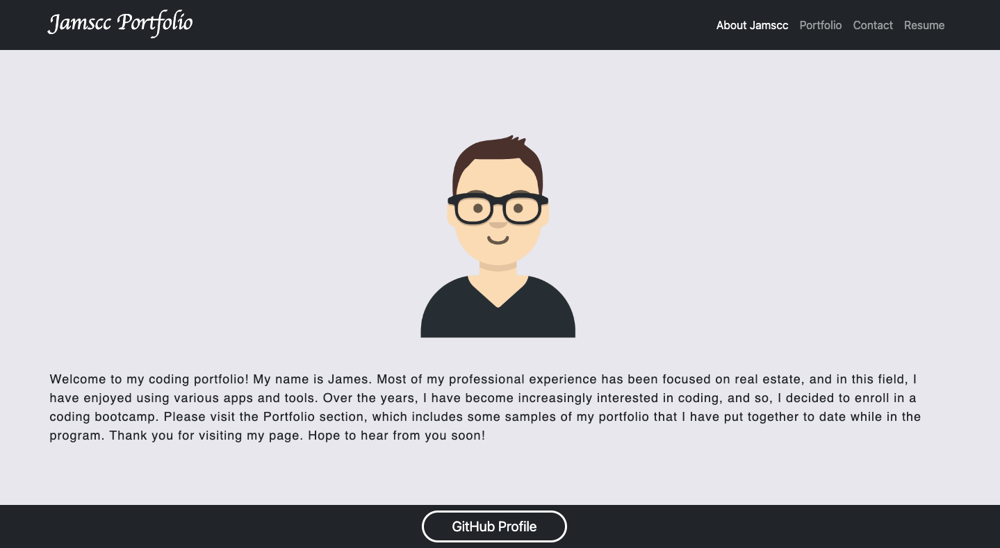

# Jamscc Portfolio (React)

## Description

Users can access this application to find information about Jamscc and selected samples of Jamscc's Coding Portfolio. In the Portfolio section, there are various links to the repositories and deployed applications (or walkthrough videos for certain projects). Users can use the navigation at the top to visit the various sections. The link to the repository for this application is provided below, and from there, the use of the following can be observed: React, Bootstrap, React Bootstrap, media queries (as part of the effort to provide a more responsive layout), gh-pages (see the package.json), and the framework provided by edX Boot Camps LLC. Please note that this application is a work in progress.

## Links

The link to the deployed application: https://jamscc.github.io/web-app-portfolio/

The link to the repository: https://github.com/jamscc/web-app-portfolio

## Screenshot

